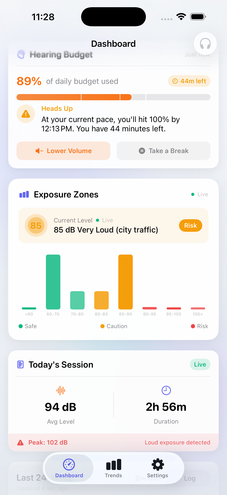
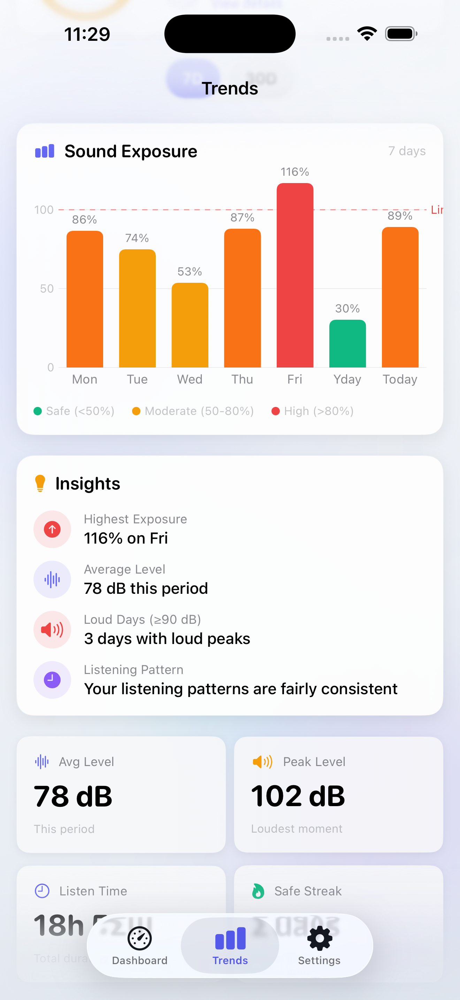
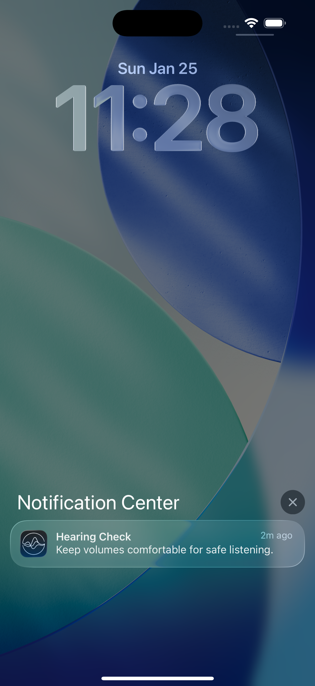

# bloop.

**Safe listening for kids. Peace of mind for parents.**

> Built at HoyaHacks 2026

## The Problem

Children are increasingly exposed to unsafe sound levels through headphones, leading to irreversible hearing damage. The WHO estimates that over 1 billion young people are at risk of hearing loss due to unsafe listening practices. Parents have no easy way to monitor and protect their children's hearing health.

## Our Solution

**bloop** is a privacy-first iOS app that tracks headphone sound exposure using Apple HealthKit data and provides intelligent, personalized recommendations to help families maintain safe listening habits.

### Key Features

- **Real-time Sound Dose Tracking** - Visual ring shows daily exposure as a percentage of safe limits
- **AI-Powered Recommendations** - Gemini-powered agentic AI analyzes listening patterns and provides personalized suggestions
- **Smart Notifications** - Proactive alerts at 50%, 80%, and 100% thresholds before damage occurs
- **Home Screen Widgets** - Glanceable dose status without opening the app
- **Live Activities & Dynamic Island** - Real-time exposure during active listening sessions
- **7-day & 30-day Trends** - Track patterns and progress over time

## Privacy First

We believe protecting hearing shouldn't mean sacrificing privacy:

- **No microphone access** - We never listen to audio content
- **No content analysis** - We don't know what you're listening to
- **100% on-device** - All data stays on your phone
- **No analytics or tracking** - Your data is yours alone

## How It Works

1. **HealthKit Integration** - Reads headphone audio exposure data (dBASPL levels) from Apple Health
2. **WHO/NIOSH Calculations** - Uses scientifically-backed formulas to calculate safe exposure limits
3. **AI Analysis** - Gemini analyzes patterns to provide actionable, kid-friendly recommendations
4. **Proactive Alerts** - Notifies before reaching unsafe levels, not after

### Sound Dose Science

Based on NIOSH/WHO guidelines:
- **85 dB** = 8 hours safe exposure
- **88 dB** = 4 hours (every +3 dB halves safe time)
- **91 dB** = 2 hours
- **94 dB** = 1 hour

## Tech Stack

| Component | Technology |
|-----------|------------|
| Platform | iOS 17+ / SwiftUI |
| Data | SwiftData + HealthKit |
| AI | Google Gemini API |
| Widgets | WidgetKit |
| Live Activity | ActivityKit |
| Architecture | MVVM |

## API Setup (Gemini AI)

bloop uses Google's Gemini API for intelligent, context-aware recommendations. The agentic AI system:

1. **Monitors listening patterns** in real-time via HealthKit samples
2. **Evaluates risk factors** (dose %, burn rate, session duration, volume levels)
3. **Decides when to intervene** with smart cooldowns to avoid notification fatigue
4. **Generates personalized insights** using Gemini 2.0 Flash

### Configuration

1. Get a free API key from [Google AI Studio](https://aistudio.google.com/app/apikey)

2. Create `HearingApp/Services/AI/Secrets.swift`:
   ```swift
   import Foundation

   enum Secrets {
       static let geminiAPIKey = "YOUR_API_KEY_HERE"
   }
   ```

3. Update `APIConfig.swift` to use your key:
   ```swift
   static let geminiAPIKey = Secrets.geminiAPIKey
   ```

### API Flow

```
┌─────────────────┐     ┌──────────────────┐     ┌─────────────────┐
│   HealthKit     │────▶│  Agentic Loop    │────▶│   Gemini API    │
│   Samples       │     │  (evaluation)    │     │   (insights)    │
└─────────────────┘     └──────────────────┘     └─────────────────┘
                               │
                               ▼
                        ┌──────────────────┐
                        │  Smart Notification │
                        │  or Live Activity   │
                        └──────────────────┘
```

The agent evaluates every 60 seconds during active listening, with a 10-minute cooldown between interventions to respect user attention.

## Team

Built with care by:
- **Kaien Hung**
- **David Xie**
- **Yiran Hu**

## Screenshots

<p align="center">
  
  
  
  
</p>

| Dashboard | Trends | Widget | Notification |
|:-:|:-:|:-:|:-:|
| Real-time dose tracking with exposure zones | 7-day history with insights | Home screen widget | Smart alerts |

## Getting Started

```bash
# Clone the repo
git clone https://github.com/YiranHu361/bloop.git

# Open in Xcode
open bloop.xcodeproj

# Build and run on device (HealthKit requires physical device)
```

**Requirements:**
- iOS 17.0+
- Xcode 15.0+
- Physical iOS device (HealthKit not available in Simulator)
- Apple Developer account (for HealthKit entitlements)

## Project Structure

```
bloop/
├── HearingApp/
│   ├── App/                    # App entry & state management
│   ├── Features/
│   │   ├── Today/              # Main dashboard with dose ring
│   │   ├── Trends/             # Weekly/monthly analytics
│   │   ├── Settings/           # Preferences & AI settings
│   │   └── Onboarding/         # Privacy-first onboarding flow
│   ├── Services/
│   │   ├── HealthKit/          # HealthKit sync service
│   │   ├── AI/                 # Gemini agentic recommendations
│   │   ├── Dose/               # Sound dose calculations
│   │   └── Notifications/      # Smart alerts & Live Activity
│   ├── Storage/                # SwiftData models
│   └── DesignSystem/           # Glassmorphism UI components
├── HearingWidget/              # Home & Lock Screen widgets
└── project.yml                 # Xcodegen configuration
```

*Protecting the next generation's hearing, one bloop at a time.*
